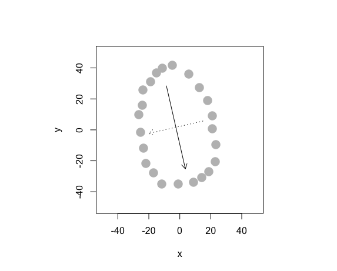
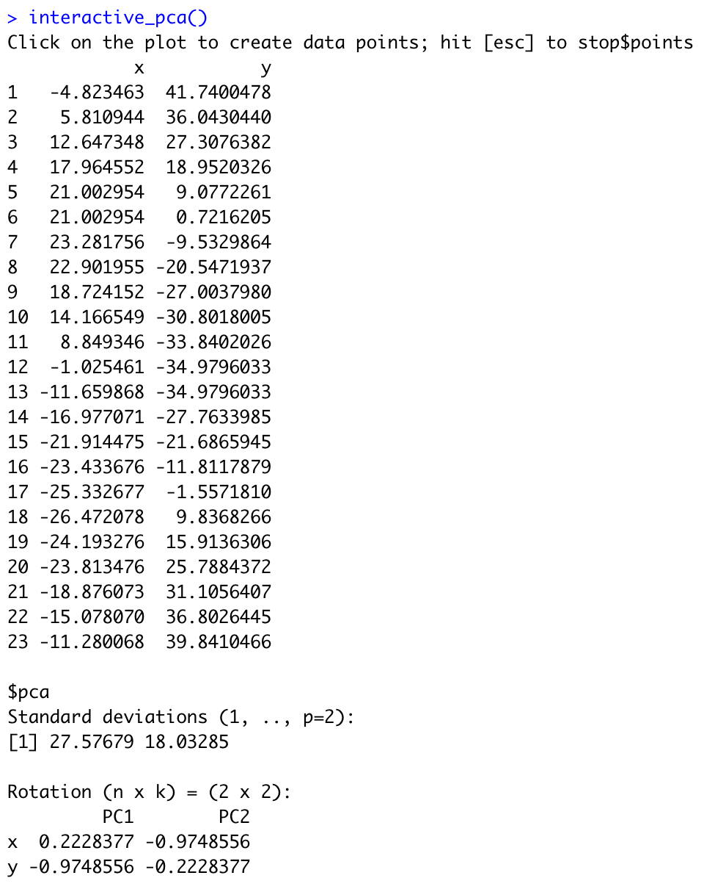
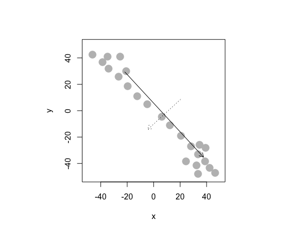
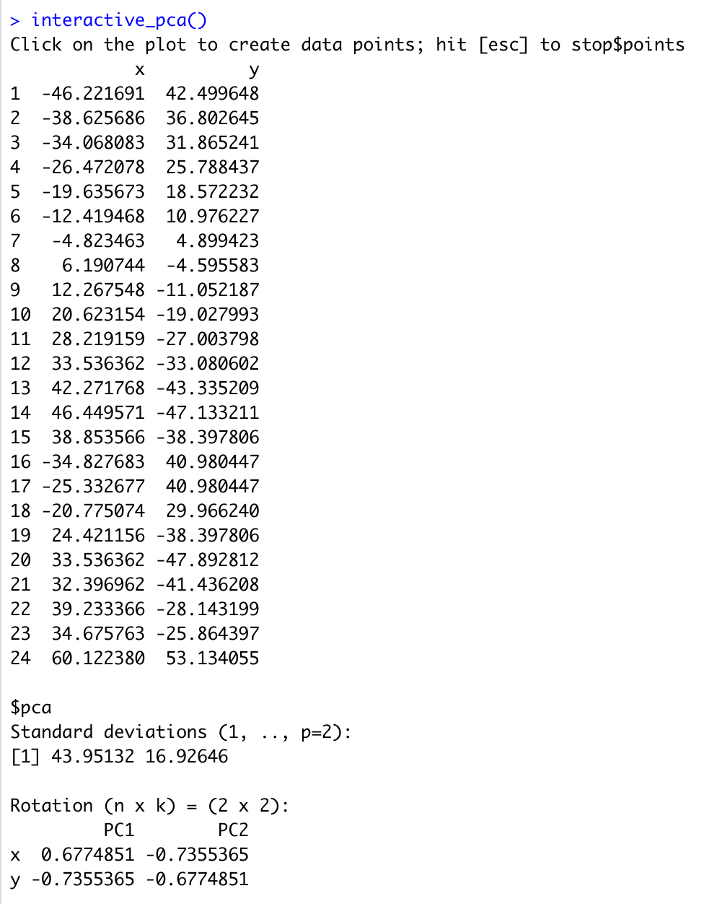

# Question 1) Let’s revisit the issue of multicollinearity of main effects (between cylinders, displacement, horsepower, and weight) we saw in the cars dataset, and try to apply principal components to it. Start by recreating the cars_log dataset, which log-transforms all variables except model year and origin.

Important: remove any rows that have missing values.

```{r}
cars <- read.table("auto-data.txt", header=FALSE, na.strings = "?")
names(cars) <- c("mpg", "cylinders", "displacement", "horsepower", "weight",
                 "acceleration", "model_year", "origin", "car_name")
cars <- na.omit(cars)
cars_log <- with(cars, data.frame(log(mpg), log(cylinders), log(displacement), log(acceleration),
                log(horsepower), log(weight), model_year, factor(origin)))
head(cars_log, 5)
```

## (a) Let’s analyze the principal components of the four collinear variables

### (i) Create a new data.frame of the four log-transformed variables with high multicollinearity

(Give this smaller data frame an appropriate name – what might they jointly mean?)

```{r}
df <- data.frame(round(cor(cars_log[,c(2,3,5,6)]), 2))
df
```

### (ii) How much variance of the four variables is explained by their first principal component?

(a summary of the prcomp() shows it, but try computing this from the eigenvalues alone)

```{r}
df_eigen <- eigen(cov(df))
df_eigen$vectors
```

### (iii) Looking at the values and valence (positiveness/negativeness) of the first principal component’s eigenvector, what would you call the information captured by this component?

(i.e., think what concept the first principal component captures or represents)

- PC1 doesn’t capture much variance of the original data
- PC2 captures high log.horsepower.
- PC3 captures high log.weight.
- PC4 doesn’t capture much variance of the original data

## (b) Let’s revisit our regression analysis on cars_log:

### (i) Store the scores of the first principal component as a new column of cars_log

cars_log$new_column_name <- ...scores of PC1...
Give this new column a name suitable for what it captures (see 1.a.i.)

```{r}
pca <- prcomp(cars_log[,c(2,3,5,6)], scale. = TRUE)
cars_log$PC1 <- pca$x[,1]
head(cars_log)
```

### (ii) Regress mpg over the column with PC1 scores (replacing cylinders, displacement, horsepower, and weight), as well as acceleration, model_year and origin.

```{r}
summary(lm(log.mpg. ~ PC1 + log.acceleration. +
             model_year + factor.origin., data = cars_log))
```

### (iii) Try running the regression again over the same independent variables, but this time with everything standardized. How important is this new column relative to other columns?

```{r}
cars_log_std <- data.frame(scale(cars_log[,c(1:7,9)]))
summary(lm(log.mpg. ~ PC1 + log.acceleration. + model_year + cars_log$factor.origin.
        , data = cars_log_std))
```

# Question 2) Please download the Excel data file security_questions.xlsx from Canvas. In your analysis, you can either try to read the data sheet from the Excel file directly from R (there might be a package for that!) or you can try to export the data sheet to a CSV file before reading it into R.

_An online marketing firm is studying how customers who shop on e-commerce websites over the winter holiday season perceive the security of e-commerce sites. Based on feedback from experts, the company has created eighteen questions (see 'questions' tab of excel file) regarding security considerations at e-commerce websites. Over 400 customers responded to these questions (see 'data' tab of Excel file). Respondents were asked to consider a shopping site they were familiar with when answering questions (site was chosen randomly from those each subject has recently visited)._

_The company now wants to use the results of these eighteen questions to reveal if there are some underlying dimensions of people's perception of online security that effectively capture the variance of these eighteen questions. Let's analyze the principal components of the eighteen items._

## (a) How much variance did each extracted factor explain?

```{r}
security_questions <- read.csv("./security_questions.csv")
sq_pca <- prcomp(security_questions)
sq_eigen <- eigen(cor(security_questions))
sq_eigen$values/sum(sq_eigen$values)
```

## (b) How many dimensions would you retain, according to the two criteria we discussed?

(Eigenvalue >= 1 and Scree Plot – can you show the screeplot with eigenvalue=1 threshhold?)

```{r}
sq_eigen$values
```

Only consider PCs with eigenvalues >= 1.

```{r}
screeplot(sq_pca, type="lines")
```

Choose only first one principal components.

# Question 3) Let’s simulate how principal components behave interactively.

- Install the package devtools in RStudio
- Run devtools::install_github("soumyaray/compstatslib")
- Load the new library: library(compstatslib)
- Run the interactive simulation using: interactive_pca()

## (a) Create an oval shaped scatter plot of points that stretches in two directions – you should find that the principal component vectors point in the major and minor directions of variance (dispersion). Show this visualization.

install.packages("devtools")
library(devtools)
devtools::install_github("soumyaray/compstatslib")
library(compstatslib)

interactive_pca()





## (b) Can you create a scatterplot whose principal component vectors do NOT seem to match the major directions of variance? Show this visualization.




