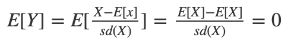
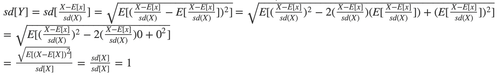

```{r, include=FALSE}
bookings <- read.table("first_bookings_datetime_sample.txt", header=TRUE)
bookings$datetime[1:9]
hours  <- as.POSIXlt(bookings$datetime, format="%m/%d/%Y %H:%M")$hour
mins   <- as.POSIXlt(bookings$datetime, format="%m/%d/%Y %H:%M")$min
minday <- hours*60 + mins
# plot(density(minday), main="Minute (of the day) of first ever booking", col="blue", lwd=2)
```

# Question 1)

Let’s reexamine how to standardize data: subtract the mean of a vector from all its values,
and divide this difference by the standard deviation to get a vector of standardized values.

## a) Create a normal distribution (mean=940, sd=190) and standardize it (let’s call it rnorm_std)

```{r}
# Standardized dataset
standardized <- function(x) {
    x <- (x-mean(x))/sd(x)
    return(x)
}
```

```{r, fig.width=5, fig.height=4, fig.align = "center"}
# create a normally distributed data set
rnorm <- rnorm(n=500, mean=940, sd=190)
rnorm_std <- standardized(rnorm)
```

### i) What should we expect the mean and standard deviation of rnorm_std to be, and why?

## We expect the mean is 0 and the standard deviation is 1.

## 

## 

Normalization typically means rescales the values into a range of [0,1].
Standardization typically means rescales data to have a mean of 0 and a standard deviation of 1 (unit variance).

```{r, fig.align = "center"}
# find its mean and std
mean(rnorm)
sd(rnorm)
mean(rnorm_std)
sd(rnorm_std)
```

### ii) What should the distribution (shape) of rnorm_std look like, and why?

the value is rescaled and the mean and std will change.
However, the curve will look the same.(explanation is beyond i))

```{r, fig.width=5, fig.height=4, fig.align = "center"}
# show the shape
hist(rnorm, main = "origin normal distribution")
hist(rnorm_std, main = "standardized normal distribution")
```

### iii) What do we generally call distributions that are normal and standardized?

Standard Normal Distribution

## b) Create a standardized version of minday discussed in question 3 (let’s call it minday_std)

```{r}
minday_std<- standardized(minday)
```

### i) What should we expect the mean and standard deviation of minday_std to be, and why?

same as a)i)

```{r}
# find its mean and std
mean(minday_std)
sd(minday_std)
```

### ii) What should the distribution of minday_std look like compared to minday, and why?

same as a)ii)

```{r, fig.width=5, fig.height=4, fig.align = "center"}
# Show the hist
hist(minday,main = "minday")
hist(minday_std,main = "minday_std")
```
