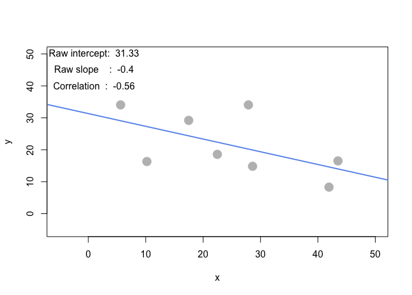
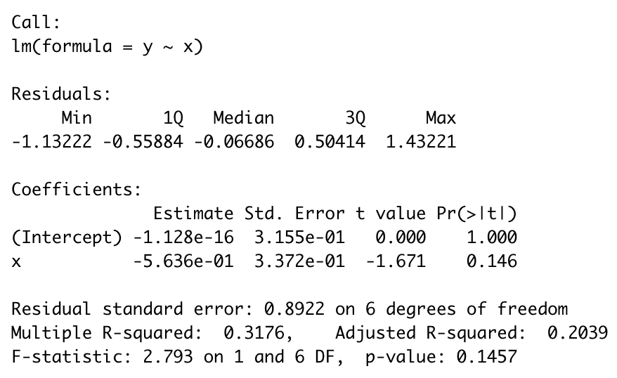

# Question 1) Let’s make an automated recommendation system for the PicCollage mobile app.

You may either use read.csv() and data.frame to load the file as before, or you can try learning how to use data.table – a high performance package for reading, writing, and managing large data sets.

```{r}
install.packages("data.table",repos = "http://cran.us.r-project.org")
library(data.table)
ac_bundles_dt <- fread("piccollage_accounts_bundles.csv")
ac_bundles_matrix <- as.matrix(ac_bundles_dt[, -1, with=FALSE])
```

## (a) Let’s explore to see if any sticker bundles seem intuitively similar:

### (i) (recommended) Download PicCollage onto your mobile from the App Store and take a look at the style and content of various bundles in their Sticker Store: how many recommendations does each bundle have? (NOTE: the Android app might not have recommendations)

ans : 6

### (ii) Find a single sticker bundle that is both in our limited data set and also in the app’s Sticker Store (e.g., “sweetmothersday”). Then, use your intuition to recommend (guess!) five other bundles in our dataset that might have similar usage patterns as this bundle.

- single sticker bundle : doodleholiday (which name is holiday doodle in the app’s Sticker Store)
- five other bundles in our dataset : pacmanholiday, washiholiday, hipsterholiday, jollyholiday, holidaycheerss

## (b) Let’s find similar bundles using geometric models of similarity:

### (i) Let’s create cosine similarity based recommendations for all bundles:

1.  Create a matrix or data.frame of the top 5 recommendations for all bundles

```{r, include=FALSE}
install.packages("lsa",repos = "http://cran.us.r-project.org")
library(lsa)
```

```{r}
cossin <- cosine(ac_bundles_matrix)
accounts_bundles <- function(x) {
  sorted <- sort(x, decreasing = TRUE)
  names(sorted)[2:6]
}
recommand_matrix <- NULL
for (i in c(1:ncol(cossin))){
  recommand_vec <- accounts_bundles(cossin[i, ])
  recommand_matrix <<- cbind(recommand_matrix, recommand_vec)
}
colnames(recommand_matrix) <- colnames(cossin)
recommand_matrix
```

2. Create a new function that automates the above functionality: it should take an accounts-bundles matrix as a parameter, and return a data object with the top 5 recommendations for each bundle in our data set, using cosine similarity.

```{r}
automate_cossin <- function(x) {
  cossin <- cosine(x)
  recommand <<- NULL
  for (i in c(1:ncol(cossin))){
    recommand_vec <- accounts_bundles(cossin[i, ])
    recommand <<- cbind(recommand, recommand_vec)
  }
  colnames(recommand) <- colnames(cossin)
  return (recommand)
}
automate_cossin(ac_bundles_matrix)
```

3. What are the top 5 recommendations for the bundle you chose to explore earlier?

for left to right is the top 5 recommendations in order.

```{r}
recommand_matrix[, "doodleholiday"]
```

### (ii) Let’s create correlation based recommendations.

1. Reuse the function you created above (don’t change it; don’t use the cor() function)

ans at 2.

2. But this time give the function an accounts-bundles matrix where each bundle (column) has already been mean-centered in advance.

```{r}
bundle_means <- apply(ac_bundles_matrix, 2, mean)
bundle_means_matrix <- t(replicate(nrow(ac_bundles_matrix),bundle_means))
ac_bundles_mc_b <- ac_bundles_matrix - c(bundle_means_matrix)
recommand_mc_b_matrix <- automate_cossin(ac_bundles_mc_b)
recommand_mc_b_matrix
```

3. Now what are the top 5 recommendations for the bundle you chose to explore earlier?

```{r}
recommand_mc_b_matrix[, "doodleholiday"]
```

### (iii) Let’s create adjusted-cosine based recommendations.

1. Reuse the function you created above (you should not have to change it)

ans at 2.

2. But this time give the function an accounts-bundles matrix where each account (row) has already been mean-centered in advance.

```{r}
bundle_means <- apply(ac_bundles_matrix, 1, mean)
bundle_means_matrix <- t(replicate(ncol(ac_bundles_matrix),bundle_means))
ac_bundles_mc_b <- ac_bundles_matrix - c(bundle_means_matrix)
recommand_mc_b_matrix <- automate_cossin(ac_bundles_mc_b)
recommand_mc_b_matrix
```

3. Now what are the top 5 recommendations for the bundle you chose to explore earlier?

```{r}
recommand_mc_b_matrix[, "doodleholiday"]
```

# Question 2) Correlation is at the heart of many data analytic methods so let’s explore it further.

Download demo_simple_regression.R from Canvas – it has a function called interactive_regression() that runs a simulation. You can click to add points to the plotting area, to see a corresponding regression line (hitting ESC will stop the simulation). You will also see three numbers: regression intercept – where the regression line crosses the y-axis; regression coefficient – the slope of x on y; correlation - correlation of x and y.

For each of the scenarios below, create the described set of points in the simulation. You might have to create each scenario a few times to get a general sense of them. Visual examples of scenarios a-d are shown below.

## (a) Create a horizontal set of random points, with a relatively narrow but flat distribution.

```{r}
set.seed(2)
points = data.frame(
  x = rnorm(300, mean = 1.5, sd=15),
  y = rnorm(300, mean = 5, sd=1.5)
)
plot(points, xlim=c(-5,20), ylim=c(-5,20), col="gray")
model <- lm(points$y ~ points$x)
abline(model, lwd=2, col="cornflowerblue")
text(15, 15, paste(c("Raw intercept: ", round(model$coefficients[1], 2)), collapse=" "))
text(15, 13, paste(c("Raw slope    : ", round(model$coefficients[2], 2)), collapse=" "))
text(15, 11, paste(c("Correlation  : ", round(cor(points$x, points$y), 2)), collapse=" "))
```

### (i) What raw slope of x and y would you generally expect?

```{r}
paste(c("Raw intercept: ", round(model$coefficients[1], 2)), collapse=" ")
```

### (ii) What is the correlation of x and y that you would generally expect?

```{r}
paste(c("Correlation  : ", round(cor(points$x, points$y), 2)), collapse=" ")
```

## (b) Create a completely random set of points to fill the entire plotting area, along both x-axis and y-axis

```{r}
set.seed(2)
points = data.frame(
  x = rnorm(300, mean = 1.5, sd=15),
  y = rnorm(300, mean = 5, sd=15)
)
plot(points, xlim=c(-5,20), ylim=c(-5,20), col="gray")
model <- lm(points$y ~ points$x)
abline(model, lwd=2, col="cornflowerblue")
text(15, 15, paste(c("Raw intercept: ", round(model$coefficients[1], 2)), collapse=" "))
text(15, 13, paste(c("Raw slope    : ", round(model$coefficients[2], 2)), collapse=" "))
text(15, 11, paste(c("Correlation  : ", round(cor(points$x, points$y), 2)), collapse=" "))
```

### (i) What raw slope of x and y would you generally expect?

```{r}
paste(c("Raw intercept: ", round(model$coefficients[1], 2)), collapse=" ")
```

### (ii) What is the correlation of x and y that you would generally expect?

```{r}
paste(c("Correlation  : ", round(cor(points$x, points$y), 2)), collapse=" ")
```

## (c) Create a diagonal set of random points trending upwards at 45 degrees

```{r}
set.seed(2)
x_add = runif(300, -5, 20)
y_add = runif(300, 0, 1)
points = data.frame(
  x <- rnorm(300, mean = 0, sd=5) + x_add,
  y <- (1/2) * x + y_add
)
plot(points, xlim=c(-5,20), ylim=c(-5,20), col="gray")
model <- lm(points$y ~ points$x)
abline(model, lwd=2, col="cornflowerblue")
text(15, 15, paste(c("Raw intercept: ", round(model$coefficients[1], 2)), collapse=" "))
text(15, 13, paste(c("Raw slope    : ", round(model$coefficients[2], 2)), collapse=" "))
text(15, 11, paste(c("Correlation  : ", round(cor(points$x, points$y), 2)), collapse=" "))
```

### (i) What raw slope of x and y would you generally expect?

```{r}
paste(c("Raw intercept: ", round(model$coefficients[1], 2)), collapse=" ")
```

### (ii) What is the correlation of x and y that you would generally expect?

```{r}
paste(c("Correlation  : ", round(cor(points$x, points$y), 2)), collapse=" ")
```

## (d) Create a diagonal set of random trending downwards at 45 degrees

```{r}
set.seed(2)
x_add = runif(300, -5, 20)
y_add = runif(300, 0, 1)
points = data.frame(
  x <- rnorm(300, mean = 0, sd=5) + x_add,
  y <- (-1/2) * x + y_add
)
plot(points, xlim=c(-5,20), ylim=c(-5,20), col="gray")
model <- lm(points$y ~ points$x)
abline(model, lwd=2, col="cornflowerblue")
text(15, 15, paste(c("Raw intercept: ", round(model$coefficients[1], 2)), collapse=" "))
text(15, 13, paste(c("Raw slope    : ", round(model$coefficients[2], 2)), collapse=" "))
text(15, 11, paste(c("Correlation  : ", round(cor(points$x, points$y), 2)), collapse=" "))
```

### (i) What raw slope of x and y would you generally expect?

```{r}
paste(c("Raw intercept: ", round(model$coefficients[1], 2)), collapse=" ")
```

### (ii) What is the correlation of x and y that you would generally expect?

```{r}
paste(c("Correlation  : ", round(cor(points$x, points$y), 2)), collapse=" ")
```

## (e) Apart from any of the above scenarios, find another pattern of data points with no correlation (r ~= 0). (can create a pattern that visually suggests a strong relationship but produces r ~= 0?)

```{r}
set.seed(2)
points = data.frame(
  x <- c(3,1,6,8,9,12,14,15,20,23),
  y <- c(4,2,10,12,18,22,18,10,8,2)
)
plot(points, xlim=c(0,25), ylim=c(0,25), col="gray")
model <- lm(points$y ~ points$x)
abline(model, lwd=2, col="cornflowerblue")
text(15, 11, paste(c("Correlation  : ", round(cor(points$x, points$y), 2)), collapse=" "))
```

Ans : Yes, can create a pattern that visually suggests a strong relationship but produces r ~= 0.
It means there is no LINEAR association. The relation between the two variables could be nonlinear.
For example, it could be a U-shaped curvilinear relation.

## (f) Apart from any of the above scenarios, find another pattern of data points with perfect correlation (r ~= 1). (can you find a scenario where the pattern visually suggests a different relationship?)

```{r}
set.seed(2)
points = data.frame(
   x <- c(3,4,5,6,20,22,22,23),
   y <- c(5,5,6,8,22,23,24,25)
 )
 plot(points, xlim=c(0,25), ylim=c(0,25), col="gray")
 model <- lm(points$y ~ points$x)
 abline(model, lwd=2, col="cornflowerblue")
 text(15, 11, paste(c("Correlation  : ", round(cor(points$x, points$y), 2)), collapse=" "))
```

Ans : Yes, can find a scenario where the pattern visually suggests a different relationship.(as pic above)

## (g) Let’s see how correlation relates to simple regression, by simulating any linear relationship you wish:

### (i) Run the simulation and record the points you create: pts <- interactive_regression() (simulate either a positive or negative relationship)

```{r, eval=FALSE}
source("demo_simple_regression.R")
pts <- interactive_regression()
pts
```




### (ii) Use the lm() function to estimate the regression intercept and slope of pts to ensure they are the same as the values reported in the simulation plot: summary( lm( pts$y ~ pts$x ))

```{r, eval=FALSE}
summary( lm( pts$y ~ pts$x ))
```


### (iii) Estimate the correlation of x and y to see it is the same as reported in the plot: cor(pts)

```{r, eval=FALSE}
cor(pts)
```


### (iv) Now, standardize the values of both x and y from pts and re-estimate the regression slope

```{r, eval=FALSE}
x <- scale(pts$x,center=TRUE,scale=TRUE)
y <- scale(pts$y,center=TRUE,scale=TRUE)
summary( lm( y ~ x ))
```



### (v) What is the relationship between correlation and the standardized simple-regression estimates?

Between the stadardized and non-stadardized data, they have same R-squared and f-statistic.
However, the stadard error is different.
