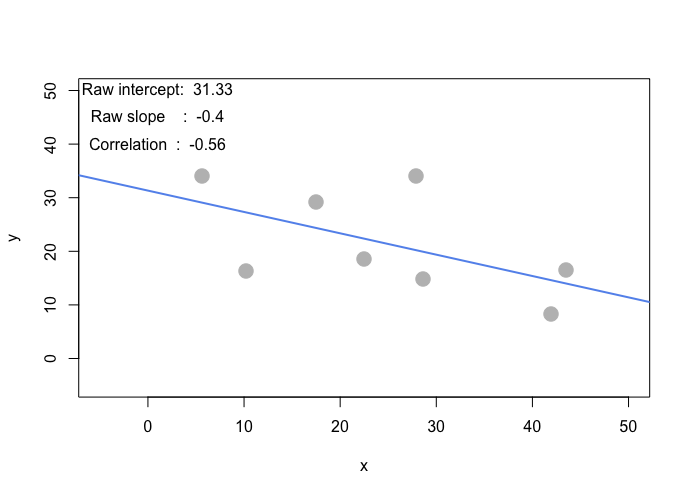
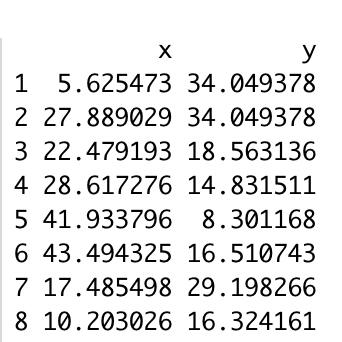
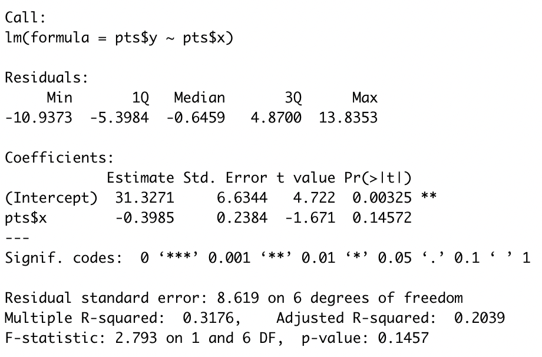
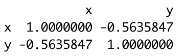
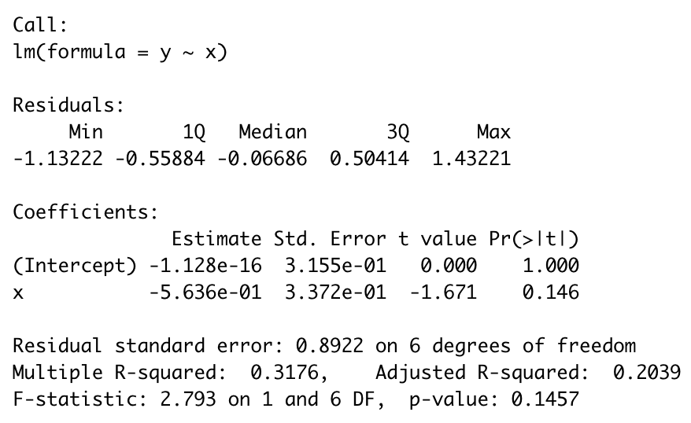

## (e) Apart from any of the above scenarios, find another pattern of data points with no correlation (r ~= 0). (can create a pattern that visually suggests a strong relationship but produces r ~= 0?)

## (f) Apart from any of the above scenarios, find another pattern of data points with perfect correlation (r ~= 1). (can you find a scenario where the pattern visually suggests a different relationship?)

## (g) Let’s see how correlation relates to simple regression, by simulating any linear relationship you wish:

### (i) Run the simulation and record the points you create: pts <- interactive_regression() (simulate either a positive or negative relationship)

```{r, eval=FALSE}
source("demo_simple_regression.R")
pts <- interactive_regression()
pts
```




### (ii) Use the lm() function to estimate the regression intercept and slope of pts to ensure they are the same as the values reported in the simulation plot: summary( lm( pts$y ~ pts$x ))

```{r, eval=FALSE}
summary( lm( pts$y ~ pts$x ))
```



### (iii) Estimate the correlation of x and y to see it is the same as reported in the plot: cor(pts)

```{r, eval=FALSE}
cor(pts)
```


### (iv) Now, standardize the values of both x and y from pts and re-estimate the regression slope

```{r, eval=FALSE}
x <- scale(pts$x,center=TRUE,scale=TRUE)
y <- scale(pts$y,center=TRUE,scale=TRUE)
summary( lm( y ~ x ))
```


### (v) What is the relationship between correlation and the standardized simple-regression estimates?

Between the stadardized and non-stadardized data, they have same R-squared and f-statistic.
However, the stadard error is different.
